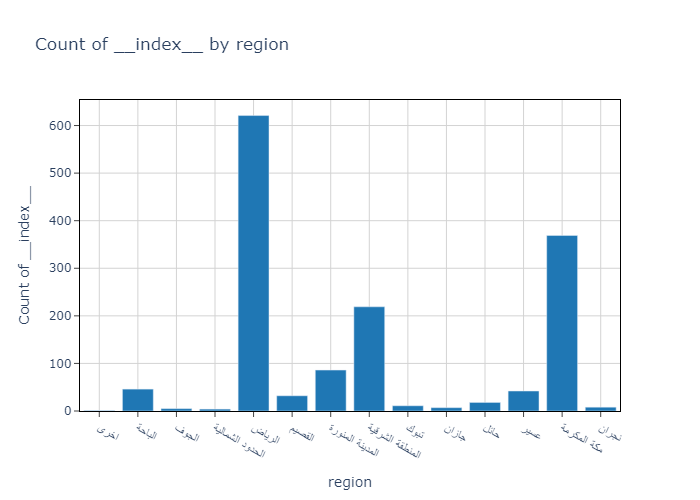
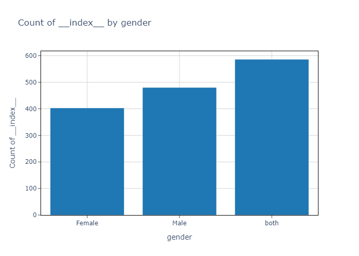
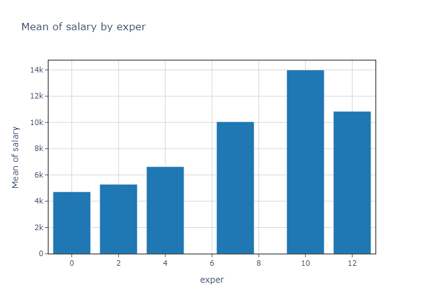
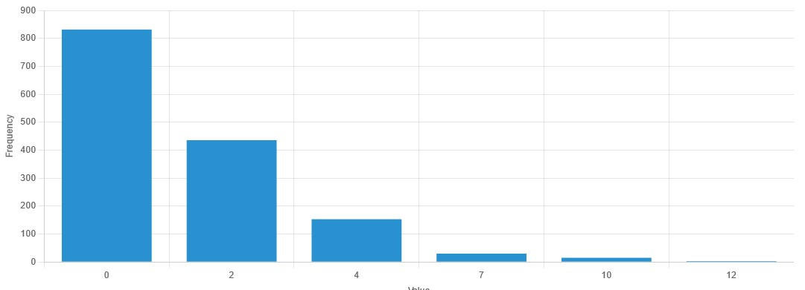
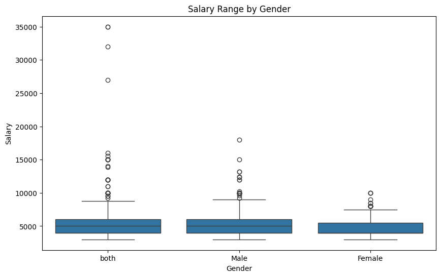
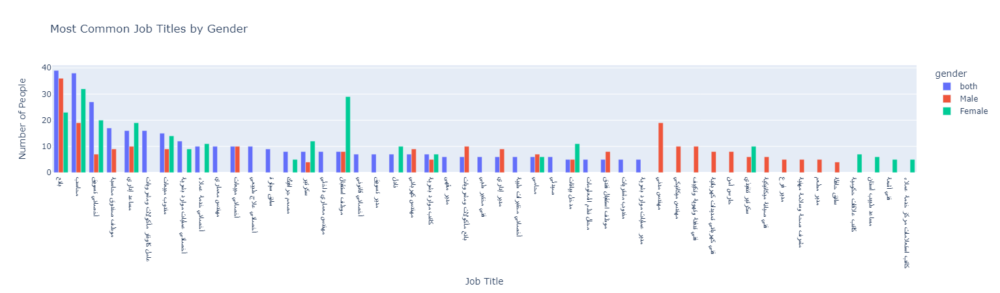

# Saudi Arabia Job Postings Analysis

## Streamlit
If you want to see the data in more detail you can visit my [Website]((https://use-case-5-5a8hdab4kaujwjk8zfpe8x.streamlit.app/))

## Overview
This project aims to analyze job postings in Saudi Arabia to understand various aspects of the employment landscape, such as the distribution of job postings by region, gender preference, salary expectations for fresh graduates, and the experience level required for job opportunities.

## Problem Statement
The primary objectives of this analysis are:
1. To determine the proportion of job postings attributed to each region within Saudi Arabia.
2. To identify any gender preferences indicated in the job postings.
3. To ascertain the expected salary range for fresh graduates.
4. To assess whether job opportunities are predominantly targeted at individuals with experience or if there is room for fresh graduates as well.

## Data Collection
The data for this analysis was collected from job postings in Saudi Arabia available on Jadara.
**Data source**: the data collected in Saudi Arabia from Jadarat, and extracted from Kaggle.
**Data License**: Public domain liecesnse.
**Data Timeliness**: The data was collected between 2022-2023.

## Data Quality Checking and Remediation
The data quality checks and necessary remediation steps were performed in the Jupyter Notebook.

1. **Handling Missing Values:**
   - Identified and removed or imputed missing values in critical columns such as `region`, `gender`, `salary`, and `experience`.

2. **Removing Duplicates:**
   - Checked for and removed duplicate records to ensure data integrity.

3. **Correcting Data Types:**
   - Ensured all columns had the correct data types, converting data types where necessary (e.g., converting `salary` to numerical format).

4. **Standardizing Values:**
   - Standardized categorical values to ensure consistency (e.g., ensuring consistent representation of regions and gender).

## Exploratory Data Analysis
The exploratory data analysis (EDA) includes various visualizations to address the questions outlined in the problem statement.

### Proportion of Job Postings by Region

### Gender Preference in Job Postings

### Expected Salary Range for Fresh Graduates

### Experience Level Required for Job Opportunities

## Analysis and Visualizations
Below are some additional visualizations from the EDA:

### Salary Range by Gender

### What are the top job opportunities for men and women?

## Conclusion
The analysis provides valuable insights into the job market in Saudi Arabia, highlighting regional distributions, gender preferences, salary expectations, and experience requirements for job postings. These insights can help job seekers and policymakers make informed decisions.

